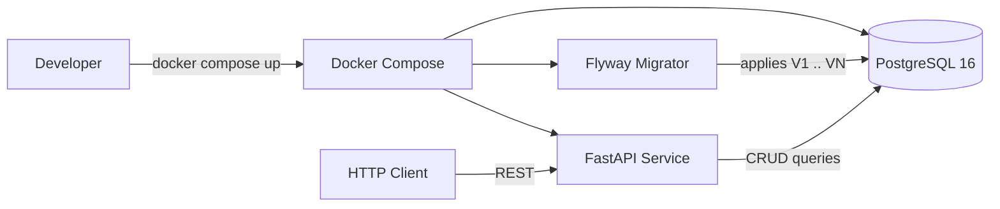
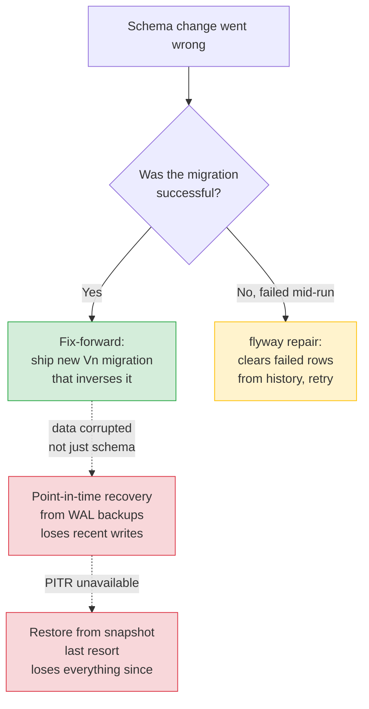

# Trading Service — Flyway Migration Workshop

A teaching artifact for platform engineers. It walks through the evolution
of a small trading service's PostgreSQL schema using **Flyway**, one step
per git branch, so you can see the schema and the FastAPI application code
grow together across four versions — including a forward-only rollback.

Use case: a trading service that records buy/sell transactions for
securities. We start with the smallest possible schema and evolve it into
something more realistic.

---

## How the workshop is structured

Each stage of the schema lives on its own branch:

| Branch                | Migrations     | What it teaches                                                                 |
|-----------------------|----------------|---------------------------------------------------------------------------------|
| `main` *(this one)*   | none           | Workshop overview. Nothing to run here.                                         |
| `step-1-v1-only`      | V1             | Bare-minimum trades table. Flyway baseline + first `INSERT`s.                   |
| `step-2-add-v2`       | V1, V2         | Adding columns to a populated table safely: nullable → backfill → NOT NULL.     |
| `step-3-add-v3`       | V1, V2, V3     | Expand-contract normalization: extract counterparty into its own table.         |
| `step-4-rollback-v3`  | V1, V2, V3, V4 | Forward-only rollback. Ship a new V4 that inverses V3 — Flyway Community has no `rollback` command. |

The application code (`app/`) evolves with the schema. Every branch has
just the code, endpoints, and test cases that match its schema level.

## Getting started

### Prerequisites

- Docker Desktop 4.x or Docker Engine 24+ with the Compose plugin
- Ports `5432` (Postgres) and `8000` (API) free on the host
- ~500 MB free disk

Python, Flyway, and the JDBC driver all run inside containers — nothing
else needs to be installed on the host.

### One-time setup

```bash
cd flyway         # wherever you cloned this repo
cp .env.example .env
```

`.env` holds local-only defaults (see `.env.example`). It is `.gitignore`d.

### Pick a stage

```bash
git branch -a                       # list branches
git checkout step-1-v1-only         # start with V1
```

There is nothing to run on `main` — it holds the workshop guide only. Every
stage lives on its own branch.

### Build

```bash
docker compose build
```

Builds the `api` image. Fast on second run thanks to layer caching.

### Start

```bash
docker compose up
```

Runs `postgres`, then `flyway` (applies pending migrations, exits `0`),
then `api`. `Ctrl+C` to stop.

Prefer detached mode plus logs:

```bash
docker compose up -d
docker compose logs -f flyway     # watch migrations apply
docker compose logs -f api        # watch the API come up
```

The API is at [http://localhost:8000](http://localhost:8000).
Interactive docs at [http://localhost:8000/docs](http://localhost:8000/docs).

### Smoke test

```bash
bash scripts/test_endpoints.sh
```

Exits `0` on success, non-zero on failure. Idempotent.

### Move to the next stage

```bash
docker compose down -v            # stop and wipe the Postgres volume
git checkout step-2-add-v2        # or step-3-add-v3, or step-4-rollback-v3
docker compose up --build         # rebuild for the new stage
```

### See what changed between stages

```bash
git diff step-1-v1-only step-2-add-v2   -- db/ app/
git diff step-2-add-v2  step-3-add-v3   -- db/ app/
git diff step-3-add-v3  step-4-rollback-v3 -- db/ app/
```

## Architecture (same on every branch)



Startup ordering is enforced by `depends_on`:

1. `postgres` becomes healthy.
2. `flyway` runs, applies pending migrations, exits `0`.
3. `api` starts and serves on port `8000`.

If Flyway fails, `api` never starts — you cannot serve traffic against a
broken schema.

## Repository layout

Files present on `main`:

```text
flyway/
├── README.md              # this file
├── CLAUDE.md              # project-scoped guidance for Claude Code sessions
├── docker-compose.yml     # postgres + flyway + api services
├── .env.example           # copy to .env before boot
├── .gitignore
└── docs/
    ├── product-brief.md
    ├── user-stories.md
    └── migration-strategy.md
```

Files added on each step branch:

```text
flyway/
├── app/                   # FastAPI service (Dockerfile, requirements, source)
├── db/migrations/         # Flyway SQL (V1__..., V2__..., V3__..., V4__...)
└── scripts/
    └── test_endpoints.sh  # smoke tests against the running stack
```

## Rollback story (step-4)

Flyway Community is **forward-only** — there is no `flyway rollback`
command. To reverse an applied change you ship a new higher-numbered
migration that inverses it. `step-4-rollback-v3` demonstrates this:
`V4` drops the counterparty table and FK that `V3` added.

When a schema change goes wrong in production, reach for these in order:



**Fix-forward is the safest option** — it keeps the audit trail intact
and follows the same gates as any other change. PITR and snapshot
restore lose writes and should be a last resort. See
[`docs/migration-strategy.md`](docs/migration-strategy.md) for the full
write-up.

## Where to go next

- New to Flyway? Read [`docs/migration-strategy.md`](docs/migration-strategy.md)
  first — it covers versioning, the `flyway_schema_history` table, checksum
  drift, the expand-contract pattern used in step 3, and the forward-only
  rollback story from step 4.
- Working on this project with Claude Code? See
  [`CLAUDE.md`](CLAUDE.md) for coding standards, common commands, and the
  guardrails specific to this repo.
- Product context (problem, users, success criteria) lives in
  [`docs/product-brief.md`](docs/product-brief.md).
- User stories covering each stage are in
  [`docs/user-stories.md`](docs/user-stories.md).
